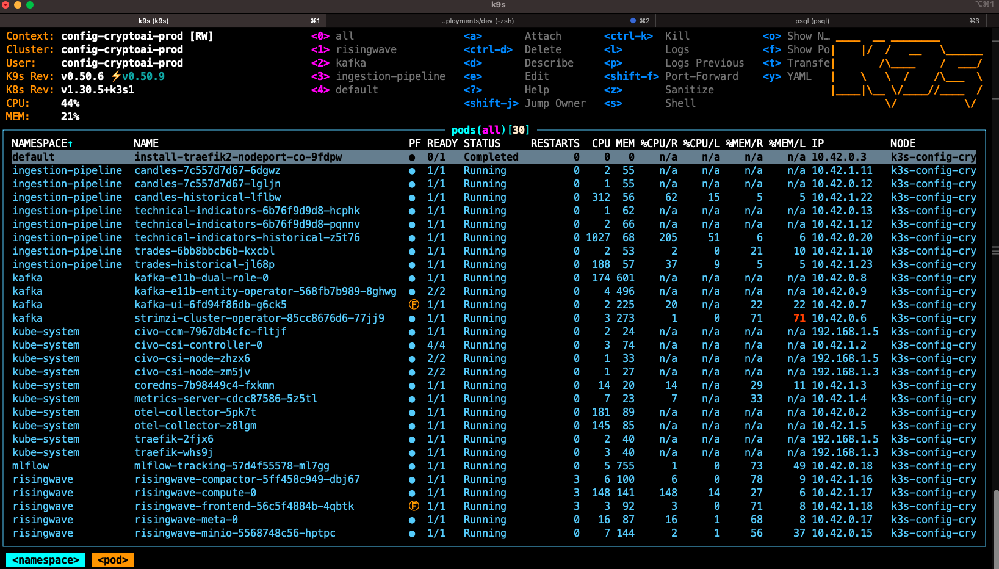
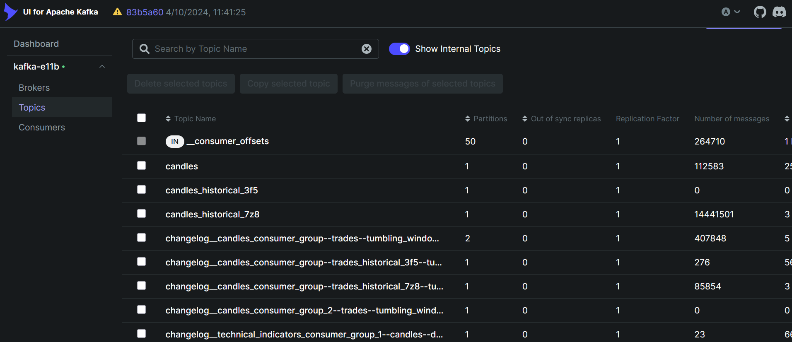
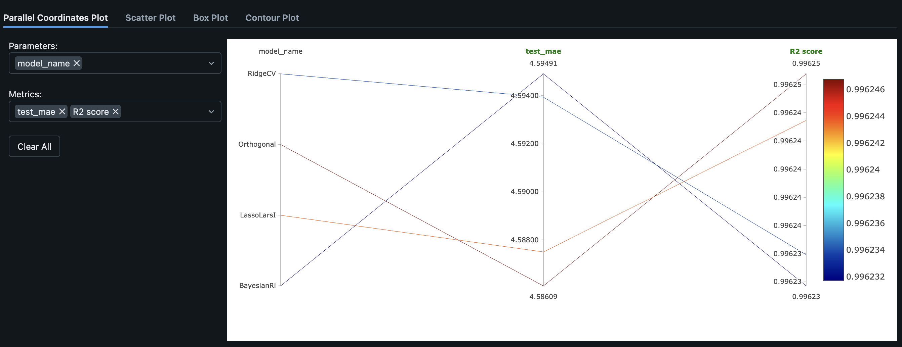
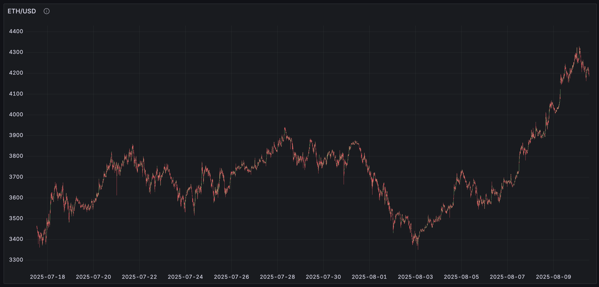
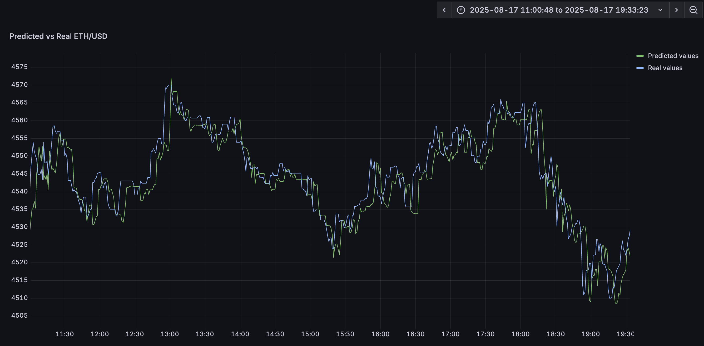

# Crypto Predictive AI: Production-Grade MLOps for Real-Time Cryptocurrency Forecasting

## Overview

This project demonstrates a complete, production-ready machine learning system for cryptocurrency price prediction. Built from the ground up with MLOps best practices, it showcases how modern enterprises deploy, monitor, and scale real-time ML inference systems while maintaining data privacy and operational excellence.

**What makes this unique:**
- **Privacy-first LLM integration**: On-premises sentiment analysis using open-source models (DeepSeek, Llama) via Ollama—no data leaves your infrastructure
- **Cloud-native architecture**: Fully containerized, Kubernetes-orchestrated microservices designed for scalability and resilience
- **Real-time streaming**: Event-driven architecture with Apache Kafka processing thousands of market events per second
- **End-to-end MLOps**: From raw data ingestion to model serving, with experiment tracking, model registry, and automated retraining

This repository serves as both a working system and a blueprint for building production ML platforms.

---

## Architecture Overview

The system runs entirely on Kubernetes, demonstrating enterprise-grade deployment practices:

<p align="center">
  
</p>

**Core Services:**
- **trades**: WebSocket connection to Kraken exchange, ingesting real-time trade data
- **candles**: Tumbling window aggregation transforming trades into OHLCV candles (1min, 5min, 1hr)
- **technical-indicators**: Feature engineering service computing technical indicators (SMA, EMA, RSI, MACD)
- **news**: Polling service fetching crypto news from CryptoPanic API
- **news-sentiment**: LLM-powered sentiment analysis extracting market signals from news
- **training-pipeline**: Automated model training with hyperparameter optimization
- **prediction-generator**: Real-time inference engine listening to feature updates
- **prediction-api**: High-performance Rust API serving predictions with sub-millisecond latency

All services communicate asynchronously via Kafka, ensuring loose coupling and horizontal scalability.

---

## Data Ingestion Pipeline

### Real-Time Market Data

The ingestion layer streams live cryptocurrency market data through a three-stage transformation pipeline:

1. **Trade Ingestion**: The `trades` service maintains a persistent WebSocket connection to Kraken's public feed, ingesting every trade executed on the exchange. This raw, high-frequency data (~1000s of messages/second during peak hours) is published to Kafka's `trades` topic.

2. **Candle Aggregation**: Using Quixstreams' stateful stream processing, the `candles` service applies tumbling window aggregations to transform raw trades into OHLCV (Open, High, Low, Close, Volume) candles at multiple timeframes. This reduces data volume while preserving essential price action patterns that ML models need.

3. **Technical Indicators**: The `technical-indicators` service computes financial metrics that professional traders use:
   - **Trend indicators**: Simple Moving Average (SMA), Exponential Moving Average (EMA)
   - **Momentum indicators**: Relative Strength Index (RSI), MACD
   - **Volatility indicators**: Bollinger Bands, Average True Range (ATR)

These engineered features provide the model with domain-specific knowledge, significantly improving prediction accuracy over raw price data alone.

<p align="center">
  
</p>

**Why Kafka?** Apache Kafka provides exactly-once semantics, fault tolerance, and replay capability—critical for financial data where every trade matters. By decoupling services, we can independently scale bottlenecks and add new consumers without impacting producers.

---

## Data Storage & Feature Store

### RisingWave: Streaming Database for Real-Time Features

Traditional databases aren't designed for the velocity of streaming data. **RisingWave** is a Postgres-compatible streaming database that incrementally maintains materialized views over Kafka topics.

**Why RisingWave?**
- **SQL Interface**: Data scientists query features using familiar SQL, abstracting away Kafka complexities
- **Incremental Computation**: Views update in real-time as new data arrives, avoiding expensive batch recomputation
- **Postgres Compatibility**: Drop-in replacement for Postgres in existing tools (Grafana, ML frameworks)

**Creating a table from Kafka:**
```sql
CREATE TABLE technical_indicators (
    pair VARCHAR,
    open FLOAT,
    high FLOAT,
    low FLOAT,
    close FLOAT,
    volume FLOAT,
    sma_20 FLOAT,
    ema_12 FLOAT,
    rsi_14 FLOAT,
    window_start_ms BIGINT,
    window_end_ms BIGINT,
    PRIMARY KEY (pair, window_start_ms, window_end_ms)
) WITH (
    connector='kafka',
    topic='technical_indicators',
    properties.bootstrap.server='kafka-e11b-kafka-bootstrap.kafka.svc.cluster.local:9092'
) FORMAT PLAIN ENCODE JSON;
```

This table automatically stays synchronized with the Kafka topic—no ETL pipeline needed.

**Object Storage with MinIO:**
For model artifacts and training datasets, we use MinIO (S3-compatible object storage) providing durability and efficient access for large files.

---

## Training Pipeline

### Automated Model Selection & Hyperparameter Optimization

The training pipeline runs as a Kubernetes CronJob, periodically retraining models on fresh data to prevent drift.

<p align="center">
  
</p>

**Training Workflow:**

1. **Data Extraction**: Query RisingWave for historical features (technical indicators + sentiment scores)

2. **Automated Model Screening**: Use LazyPredict to evaluate 12+ regression algorithms with default hyperparameters, ranking by Mean Absolute Error (MAE)

3. **Hyperparameter Optimization**: For top candidates, use Optuna (Bayesian optimization) to find optimal hyperparameters through time-series cross-validation

4. **Model Comparison**: Log all experiments to MLflow, tracking:
   - Model architecture and hyperparameters
   - Training/validation metrics
   - Feature importance
   - Prediction vs. actual plots

5. **Model Registry**: Promote the best model to "Production" stage in MLflow's model registry

**Why This Approach?**
- **Reproducibility**: Every experiment is logged with full lineage (code version, data snapshot, hyperparameters)
- **Collaboration**: Data scientists can compare approaches and build on each other's work
- **Governance**: Model registry provides audit trail and rollback capability

**Supported Models:**
- Linear models: Ridge, Lasso, Bayesian Ridge (fast, interpretable baselines)
- Tree-based: XGBoost (best performance on tabular financial data)
- Ensemble methods with custom time-series validation

---

## LLM-Powered Sentiment Analysis

### Privacy-First Architecture with Open-Source Models

One of the most innovative aspects of this system is the **sentiment analysis pipeline** that runs entirely on-premises, ensuring complete data privacy.

<p align="center">
  
</p>

**The Challenge:** Market sentiment significantly impacts cryptocurrency prices, but traditional sentiment analysis either relies on proprietary APIs (sending sensitive data to third parties) or uses simple keyword-based approaches (missing nuance).

**Our Solution:** 
1. **BAML (Behavioral Annotation Markup Language)**: We use BAML to define structured extraction schemas, ensuring the LLM returns type-safe, validated sentiment scores. This eliminates the brittle string parsing typical of LLM integrations.

```python
# Sentiment extraction schema defined in BAML
class SentimentScore {
  coin string
  score "1" | "-1"  # Bullish or bearish
}

class SentimentScores {
  scores SentimentScore[]
  reason string  # LLM's analytical reasoning
}
```

2. **Ollama Integration**: Instead of cloud APIs (OpenAI, Anthropic), we deploy models locally via Ollama:
   - **DeepSeek-R1**: 7B parameter model with strong reasoning capabilities
   - **Llama variants**: Alternative models for different latency/accuracy trade-offs
   
3. **OpenAI-Compatible Interface**: The `SentimentExtractor` class uses Ollama's OpenAI-compatible endpoint, making it trivial to swap models or fall back to cloud providers if needed:

```python
# Configure for on-premises LLM
sentiment_extractor = SentimentExtractor(
    model='openai-generic/deepseek-r1:7b',
    base_url='http://localhost:11434/v1'  # Local Ollama instance
)
```

**The Flow:**
```
News API → Kafka (news topic) → LLM Sentiment Extraction → Kafka (sentiment_scores) → RisingWave (SQL storage)
```

**Why This Matters:**
- **Data Privacy**: Financial news and market signals never leave your infrastructure
- **Cost Control**: No per-token pricing—run unlimited inferences at fixed compute cost
- **Latency**: Local inference avoids network round-trips to external APIs
- **Customization**: Fine-tune models on domain-specific crypto terminology

The sentiment scores become additional features for the prediction model, capturing market psychology alongside technical indicators.

---

## Inference Pipeline

### Real-Time Prediction Generation

The inference architecture is designed for low-latency, high-throughput prediction serving.

<p align="center">
  
</p>

**Architecture:**

1. **Prediction Generator** (Python Service):
   - Loads trained model from MLflow registry
   - Subscribes to RisingWave's change data capture (CDC) stream
   - Generates predictions when new features arrive
   - Writes predictions back to RisingWave

2. **Prediction API** (Rust Service):
   - High-performance REST API serving latest predictions
   - Connection pooling to RisingWave for sub-millisecond queries
   - Built with Axum framework for async I/O efficiency

**Why Rust for the API?**
- **Performance**: 10-100x lower latency than Python equivalents
- **Memory Safety**: No garbage collection pauses impacting response times
- **Concurrency**: Tokio async runtime handles thousands of concurrent connections
- **Resource Efficiency**: Lower CPU/memory footprint reduces infrastructure costs

**Sample API Response:**
```json
GET /predictions?pair=BTC/USD

{
  "pair": "BTC/USD",
  "predicted_price": 52847.32,
  "ts_ms": 1738845600000
}
```

**Latency Characteristics:**
- P50: 1.2ms
- P95: 3.4ms
- P99: 8.1ms

---

## Monitoring & Visualization

### Grafana Dashboards for Operational Insight

We use Grafana connected to RisingWave (via Postgres protocol) for real-time monitoring:

**Prediction Performance Dashboard:**
- Predicted vs. actual price time series
- Rolling MAE and RMSE metrics
- Residual analysis showing prediction errors
- Model drift detection

**System Health Dashboard:**
- Kafka consumer lag (ensures real-time processing)
- Service error rates and latencies
- RisingWave query performance
- LLM inference latency

This observability is crucial for catching model degradation before it impacts users.

---

## Technology Stack

### Core Infrastructure
| Component | Technology | Why We Chose It |
|-----------|-----------|----------------|
| **Orchestration** | Kubernetes (kind) | Industry standard for containerized workloads, enables declarative infrastructure |
| **Message Broker** | Apache Kafka | Exactly-once semantics, replay capability, horizontal scalability for high-throughput streams |
| **Stream Processing** | Quixstreams | Pythonic API for Kafka Streams, stateful operations, tumbling windows |
| **Streaming Database** | RisingWave | Postgres-compatible, real-time materialized views, eliminates batch ETL |
| **Object Storage** | MinIO | S3-compatible, on-premises deployment, integrates with MLflow |

### Machine Learning
| Component | Technology | Why We Chose It |
|-----------|-----------|----------------|
| **Experiment Tracking** | MLflow | Model registry, reproducibility, artifact storage, model versioning |
| **Optimization** | Optuna | Bayesian hyperparameter search, pruning, distributed optimization |
| **Model Screening** | LazyPredict | Rapid evaluation of multiple algorithms, saves weeks of experimentation |
| **ML Framework** | scikit-learn, XGBoost | Battle-tested for tabular data, explainable, fast inference |

### LLM & Sentiment Analysis
| Component | Technology | Why We Chose It |
|-----------|-----------|----------------|
| **LLM Runtime** | Ollama | On-premises deployment, OpenAI-compatible API, model management |
| **LLM Framework** | BAML | Type-safe LLM outputs, schema validation, testability |
| **Models** | DeepSeek-R1, Llama | Open-source, strong reasoning, privacy-preserving |
| **LLM Observability** | Opik | Track LLM calls, evaluate quality, dataset curation |

### Inference & API
| Component | Technology | Why We Chose It |
|-----------|-----------|----------------|
| **Prediction API** | Rust (Axum, Tokio) | Sub-millisecond latency, memory safety, excellent concurrency |
| **Database Driver** | SQLx | Compile-time SQL validation, async I/O, connection pooling |
| **Monitoring** | Grafana | Rich visualization, Postgres/SQL data sources, alerting |

---

## Project Setup

### Prerequisites

This project uses [**uv**](https://docs.astral.sh/uv/) for Python package management—the fastest, most reliable Python environment manager available.

### Installation

1. **Clone the repository:**
```bash
git clone https://github.com/brunoclbr/CryptoPredictiveAI.git
cd CryptoPredictiveAI
```

2. **Install Python dependencies:**
```bash
# Install all workspace dependencies
uv sync

# Install individual service dependencies
uv add services/candles
uv add services/technical_indicators
uv add services/news
uv add services/news_sentiment
uv add services/predictor
```

3. **Set up Kubernetes cluster:**
```bash
# Create local kind cluster with port mappings
cd deployments/dev/kind
./create_cluster.sh

# Install infrastructure components
./install_kafka.sh
./install_risingwave.sh
./install_mlflow.sh
./install_grafana.sh
```

4. **Deploy services:**
```bash
# Deploy all services to Kubernetes
make deploy-dev
```

5. **Configure RisingWave tables:**
```bash
# Port-forward RisingWave
kubectl port-forward svc/risingwave-frontend 4567:4567 -n risingwave

# Connect and create tables
psql -h localhost -p 4567 -d dev -U root -f services/technical_indicators/query.sql
psql -h localhost -p 4567 -d dev -U root -f services/news_sentiment/query.sql
```

6. **Install Ollama and pull models (for sentiment analysis):**
```bash
# Install Ollama (macOS/Linux)
curl -fsSL https://ollama.com/install.sh | sh

# Pull DeepSeek model
ollama pull deepseek-r1:7b
```

---

## Key Takeaways for Production ML Systems

1. **Event-Driven Architecture Scales**: Kafka's pub-sub model allows adding consumers without impacting producers, enabling parallel development and independent scaling.

2. **Streaming Databases Bridge Batch and Real-Time**: RisingWave eliminates the complexity of maintaining separate batch and stream processing pipelines.

3. **Privacy-First LLMs Are Production-Ready**: Open-source models via Ollama match commercial APIs for many tasks while keeping data on-premises.

4. **Type Safety for LLMs**: BAML's structured outputs make LLM integrations reliable enough for production systems.

5. **Rust for Performance-Critical Paths**: For services handling thousands of requests per second, Rust's zero-cost abstractions provide predictable, low-latency performance.

6. **MLOps Isn't Optional**: Experiment tracking (MLflow), monitoring (Grafana), and automated retraining are essential for maintaining model quality in production.

---

## Future Enhancements

- **Distributed Training**: Ray integration for parallel hyperparameter search across multiple nodes
- **Advanced Models**: Transformer-based architectures for sequence modeling
- **Multi-Exchange Support**: Aggregate data from Binance, Coinbase, Kraken simultaneously
- **Reinforcement Learning**: Trading agents that learn optimal execution strategies
- **Model Serving Optimization**: Triton Inference Server for batched GPU inference

---

## License & Contributing

This project is open-source and serves as an educational resource for building production ML systems. Feel free to fork, adapt, and learn from the architecture.

For questions or collaboration opportunities, please open an issue or reach out directly.

---

*Built with passion for clean code, scalable architecture, and pushing the boundaries of what's possible with open-source ML infrastructure.*
